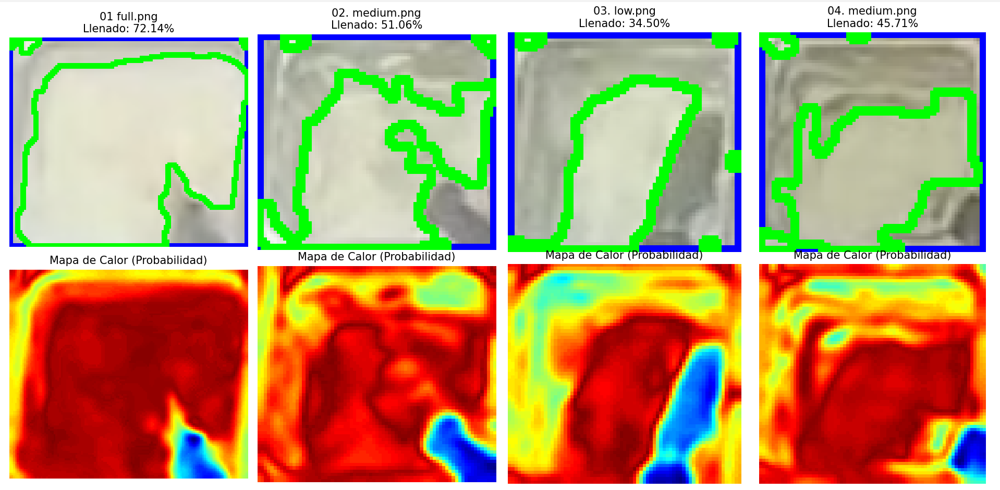

# Informe Técnico: Algoritmo de Clasificación de Píxeles por Clustering para Detección de Aderezos de Bajo Contraste (Mayonesa)

**Fecha:** 19 de Enero, 2026  
**Contexto:** Visión por Computador / Proyecto de Titulación Ingeniería de Software  
**Objeto de Estudio:** Segmentación de mayonesa en bandejas de polímero de alta reflectancia.

---

## 1. Resumen Ejecutivo
La cuantificación de mayonesa representa un desafío de **segmentación por proximidad lumínica**, dado que el producto y el contenedor comparten rangos de intensidad similares en el espectro visible. La metodología propuesta abandona la umbralización estática en favor de un enfoque de **aprendizaje no supervisado (Clustering K-Means)**. El algoritmo particiona el espacio de color de la imagen de forma adaptativa, permitiendo una separación robusta de la salsa incluso bajo condiciones de iluminación variable o sombras proyectadas.

---

## 2. Resultados Visuales

A continuación se presentan los resultados de la segmentación donde se logra distinguir la masa de la salsa (contorno verde) del límite de la bandeja (contorno azul), incluso en muestras con bajo nivel de llenado:

  
  
<em>Figura 1: Comparativa de detección adaptativa en niveles Full, Medium y Low.</em>

---

## 3. Metodología

El sistema implementa una arquitectura de clasificación basada en la distribución estadística de los datos cromáticos en lugar de reglas de decisión fijas:

### 3.1. Invarianza Lumínica en el Espacio CIELAB
Se realiza la conversión del espacio de color RGB al espacio **CIELAB ($L^*a^*b^*$)**. Esta transformación es crítica para este objeto de estudio, ya que permite aislar la información de **Luminosidad ($L^*$)** de los componentes cromáticos. Dado que la mayonesa y la bandeja son cromáticamente neutras, la distinción se fundamenta en la sutil diferencia de reflectancia capturada en el canal $L^*$.

[Image of CIELAB color space diagram]

### 3.2. Segmentación Adaptativa mediante K-Means Clustering
Se modela la imagen como un conjunto de observaciones tridimensionales en el espacio Lab. Se aplica el algoritmo de agrupamiento K-Means para clasificar los píxeles en $K=3$ categorías funcionales:
* **Salsa**: Cuerpo de alta reflectancia.
* **Bandeja**: Tonos medios y grises neutros.
* **Entorno**: Fondo y sombras de baja intensidad.

El algoritmo minimiza la varianza intracuadrática para encontrar los centroides óptimos $\mu$:

$$\arg\min_{S} \sum_{i=1}^{K} \sum_{x \in S_i} \| x - \mu_i \|^2$$

### 3.3. Identificación Automática del Target (Max-Luminosity Selection)
A diferencia de métodos supervisados, el sistema identifica automáticamente el cluster correspondiente a la mayonesa analizando los vectores de los centroides resultantes. Se selecciona el cluster cuya coordenada en el eje $L^*$ sea máxima, asumiendo que el aderezo blanco posee la mayor reflectancia de la escena:

$$C_{target} = \max(\mu_{i, L^*})$$

### 3.4. Refinamiento Espacial y Post-procesamiento
Para garantizar que el cálculo de área sea preciso, se aplican dos etapas de control:
* **Filtro de Apertura Morfológica (Opening)**: Se utiliza un kernel de $5 \times 5$ para eliminar falsos positivos generados por el brillo especular en las paredes de la bandeja.
* **Restricción de Dominio**: Se realiza una intersección lógica con la máscara de la bandeja para asegurar que el porcentaje se calcule exclusivamente sobre el área útil del contenedor.

La métrica de ocupación final se determina mediante la relación de densidad de píxeles:
$$P_{llenado} = \left( \frac{\sum Pixeles_{Sauce}}{\sum Pixeles_{Tray}} \right) \times 100$$

---

## 4. Conclusión Técnica
El uso de **Clustering K-Means** resuelve la ambigüedad del umbral fijo. Al recalcular la frontera de decisión para cada imagen individualmente, el algoritmo es capaz de distinguir entre el blanco de la mayonesa y el gris de la bandeja, incluso cuando la exposición de la cámara varía. Esta técnica proporciona una base estadística sólida para los resultados presentados en el cuerpo de la tesis.