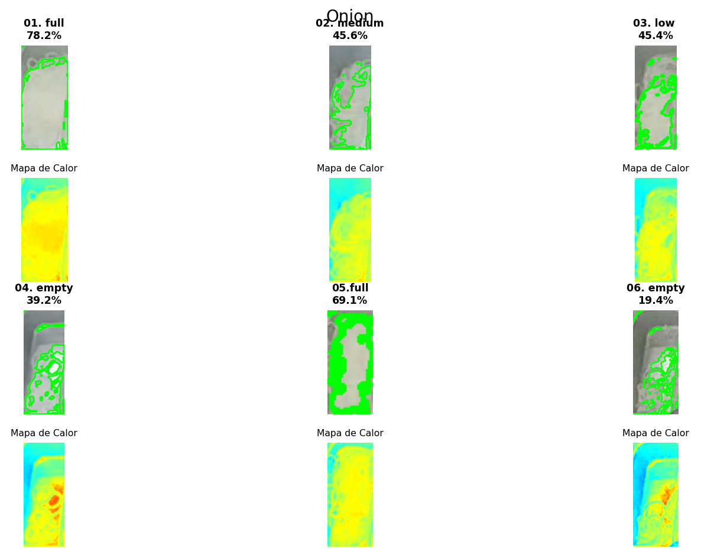

# Informe Técnico: Algoritmo de Segmentación Cromática y de Intensidad para Detección de Vegetales en Superficies Reflectantes

**Fecha:** 26 de Noviembre, 2025  
**Contexto:** Visión por Computador / Procesamiento de Imágenes  
**Objeto de Estudio:** Segmentación de cebolla procesada en bandejas de acero inoxidable.

---

## 1. Resumen Ejecutivo
El presente documento describe la metodología algorítmica implementada para la cuantificación automática de producto (cebolla) sobre contenedores metálicos. El desafío principal abordado es la **discriminación de luminancia** entre la materia orgánica (cebolla blanca/amarilla) y la superficie inorgánica (acero inoxidable), las cuales presentan coeficientes de reflexión similares, agravado por la presencia de reflejos especulares (glare) de la iluminación ambiental.

La solución implementada evita el uso de modelos de aprendizaje profundo (Deep Learning) en favor de técnicas clásicas de **procesamiento de histograma y filtrado espacial**, optimizando el costo computacional y garantizando determinismo en los resultados.

---
### Resultados Visuales

Resultados obtenidos mediante el filtrado de banda estrecha en escala de grises (Rango 145-170):

  
  
<em>Figura 1: Aislamiento de la cebolla basado en su firma de intensidad específica.</em>

## 2. Metodología

El flujo de procesamiento (pipeline) consta de tres etapas fundamentales basadas en la física de la formación de la imagen:

### 2.1. Transformación Lineal de Intensidad (Linear Contrast Scaling)

Para mitigar la saturación provocada por los reflejos del metal y separarlos del albedo natural de la cebolla, se aplica una operación de punto de **reducción de ganancia**.

Matemáticamente, la imagen de entrada $f(x,y)$ se transforma en $g(x,y)$ mediante la ecuación:

$$g(x,y) = \alpha \cdot f(x,y) + \beta$$

Donde:
* **$\alpha = 0.8$ (Factor de escala):** Comprime el rango dinámico del histograma. Esto desplaza los valores de la cebolla (originalmente cercanos a la saturación) hacia la zona media del histograma, mientras que los reflejos especulares (saturación pura) se mantienen en el extremo superior, permitiendo su posterior separación.
* **$\beta = 0$ (Offset):** No se aplica desplazamiento de brillo.

**Objetivo Técnico:** Aumentar la separabilidad inter-clase entre los píxeles de "Materia Orgánica" y "Reflejo Especular".

### 2.2. Segmentación por Corte de Intensidad (Intensity Slicing)

Se implementa un **Filtro de Paso de Banda (Band-Pass Filter)** en el dominio de la intensidad de gris. A diferencia de la umbralización binaria simple ($T > x$), esta técnica define un intervalo de aceptación $[T_{min}, T_{max}]$ que actúa como una función rectangular de selección.

Se genera una máscara binaria $M(x,y)$ tal que:

$$M(x,y) = \begin{cases} 1 & \text{si } 145 \le g(x,y) \le 170 \\ 0 & \text{en otro caso} \end{cases}$$

**Justificación de los Umbrales:**
* **Límite Inferior ($T_{min} = 145$):** Rechazo de la banda de baja frecuencia (fondo metálico oscuro, sombras y tonos verdosos/cian en la visualización térmica).
* **Límite Superior ($T_{max} = 170$):** Rechazo de la banda de alta frecuencia (reflejos especulares y zonas de saturación, correspondientes a los tonos rojos en la visualización térmica).
* **Zona de Paso (Band-Pass):** Captura exclusiva de la "zona media-alta" del histograma, correspondiente a la pigmentación natural de la cebolla (tonos amarillos/naranjas).

### 2.3. Extracción de Fronteras Topológicas (Boundary Extraction)

Para la cuantificación del área, se extraen los contornos vectoriales de la máscara binaria $M(x,y)$. Se utiliza el algoritmo de **Seguimiento de Bordes (Border Following)** con dos características críticas:

1.  **Análisis Topológico (`cv2.RETR_TREE`):**
    El algoritmo recupera la jerarquía completa de los contornos anidados. Esto permite detectar no solo el perímetro exterior de la masa vegetal, sino también los **agujeros interiores**.
    * *Aplicación:* Si una sección de la cebolla presenta un brillo excesivo (glare), el paso 2.2 la elimina (hueco negro). El análisis topológico identifica este hueco como "no perteneciente" al cálculo de área, mejorando la precisión.

2.  **Codificación de Cadena No-Aproximada (`cv2.CHAIN_APPROX_NONE`):**
    Se evita la aplicación de algoritmos de simplificación poligonal (como Ramer-Douglas-Peucker). Se almacenan todos los puntos $(x,y)$ de la frontera.
    * *Resultado:* Se obtiene una representación morfológica **fiel y "pixel-perfecta"**, evitando la suavización artificial de los bordes que podría introducir errores de medición en texturas irregulares.

---

## 3. Resultados y Visualización

La eficacia del algoritmo se valida mediante mapas de calor (Heatmaps) aplicados a la imagen en escala de grises pre-procesada:

* **Zonas Frías (Azul/Verde):** Rechazadas por $T_{min}$ (Fondo).
* **Zonas Cálidas (Naranja/Amarillo):** Aceptadas por el filtro de banda (Cebolla).
* **Zonas Críticas (Rojo):** Rechazadas por $T_{max}$ (Reflejos).

### Conclusión Técnica
La combinación de **escalado lineal** previo a un **filtrado de banda estrecha** demuestra ser una estrategia robusta para entornos con iluminación no controlada sobre superficies metálicas, logrando aislar la materia de interés sin necesidad de entrenamiento de modelos estocásticos.