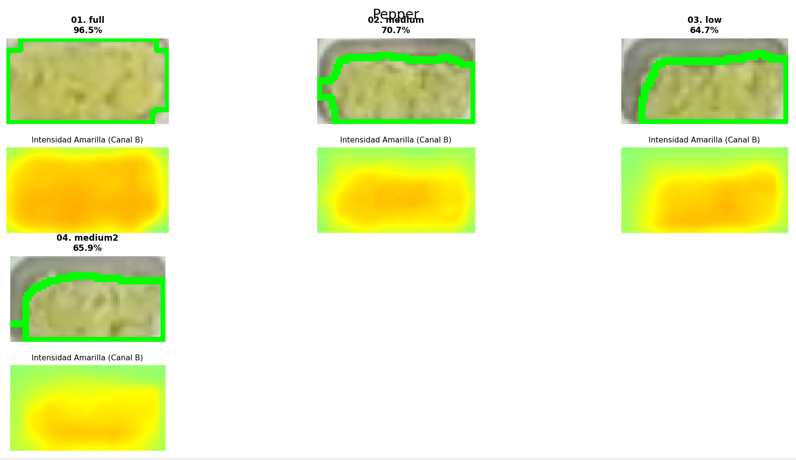

# Informe Técnico: Algoritmo de Segmentación Volumétrica en Espacio LAB para Detección de Pimientos

**Fecha:** 01 de Diciembre, 2025  
**Contexto:** Visión por Computador / Procesamiento de Imágenes  
**Objeto de Estudio:** Segmentación de pimientos troceados (*Bell Peppers*) en bandejas de acero inoxidable.

---

## 1. Resumen Ejecutivo
El presente documento detalla la metodología algorítmica para la cuantificación de vegetales de cuerpo sólido (pimientos). A diferencia de las hojas planas (lechuga), los pimientos presentan dos desafíos únicos: una **superficie cerosa** que genera fuertes reflejos especulares (puntos blancos brillantes) y una **geometría volumétrica** (cubos). La solución implementada utiliza el canal de crominancia **B** del espacio de color **CIE L*a*b*** para aislar la pigmentación amarilla/verdosa, combinado con operaciones morfológicas de cierre para recuperar la integridad estructural del objeto frente a los brillos.

---
### Resultados Visuales

Segmentación volumétrica basada en el Canal B del espacio CIE L*a*b* y reconstrucción morfológica:

  
  
<em>Figura 1: Mapa de calor del Canal B representando la intensidad cromática amarilla.</em>

## 2. Metodología

El enfoque RGB tradicional falla debido a que los reflejos blancos en el pimiento tienen valores altos en los tres canales ($R=G=B=255$), confundiéndose con el fondo o perdiendo información de color. Se adopta una estrategia de desacople de luminancia y crominancia.

### 2.1. Selección del Espacio de Color (CIE L*a*b*)

Se transforma la imagen al espacio **L*a*b***, diseñado para aproximar la visión humana. Este espacio separa la luminosidad ($L$) de la información de color ($a$ y $b$).

* **Canal $L$:** Luminosidad (Ignorado para evitar sesgos por sombras o brillos excesivos).
* **Canal $a$:** Eje Verde-Rojo.
* **Canal $b$:** Eje Azul-Amarillo (Seleccionado como descriptor principal).

**Fundamento Físico en el Canal $B$:**
En la implementación digital de OpenCV (8-bits):
* **Valor Neutro (Metal):** El gris acromático se sitúa en el centro del espectro ($B \approx 128$).
* **Pimiento (Amarillo/Verde):** La pigmentación del pimiento empuja el valor hacia el extremo positivo del eje amarillo ($B > 140$).
* **Contraste:** Esta propiedad permite una binarización robusta donde el metal se mantiene estable en valores medios, mientras el producto destaca en valores altos.

### 2.2. Umbralización Cromática

Se aplica una segmentación por umbral simple sobre el Canal $B$ aislado. A diferencia de métodos adaptativos, aquí se busca un corte absoluto que separe lo "cálido/amarillo" de lo "neutro/gris".

**Umbral de Corte:** $T = 142$

$$M(x,y) = \begin{cases} 255 & \text{si } Channel_B(x,y) > 142 \\ 0 & \text{en caso contrario} \end{cases}$$

Este valor es crítico para rechazar el metal sucio (que puede tener tintes cálidos leves) pero aceptar la pulpa del pimiento.

### 2.3. Reconstrucción Morfológica (Handling Specular Highlights)

El pimiento húmedo refleja la luz de las lámparas, creando "agujeros" blancos en la máscara binaria (el blanco puro no tiene información de color amarillo, por lo que el paso 2.2 lo descarta). Para corregir esto, se aplica una operación de **Cierre Morfológico (Morphological Closing)**:

1.  **Operación:** Dilatación seguida de Erosión ($Close = Erode(Dilate(src))$).
2.  **Kernel:** Matriz rectangular de $5 \times 5$.
3.  **Efecto:** Actúa como un "puente", conectando los píxeles amarillos que rodean un brillo blanco. Esto rellena los huecos internos del pimiento, consolidando el cubo troceado como un objeto sólido y recuperando el área perdida por el reflejo.

---

## 3. Conclusión Técnica

La segmentación basada en el **Canal B del espacio Lab** demuestra ser la estrategia óptima para vegetales con componentes amarillos/verdosos en entornos metálicos. La clave del éxito en esta matriz específica (pimiento) no reside solo en el color, sino en el post-procesamiento morfológico (**Closing**), que mitiga el efecto de los reflejos especulares propios de superficies lisas y húmedas, garantizando una medición de área fiel a la biomasa presente.