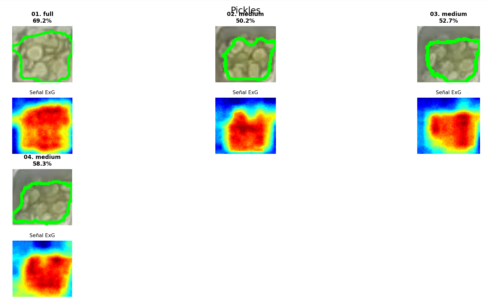

# Informe Técnico: Algoritmo Híbrido Espectral-Saturación para Segmentación de Pepinillos (Pickles)

**Fecha:** 01 de Diciembre, 2025  
**Contexto:** Visión por Computador / Procesamiento de Imágenes  
**Objeto de Estudio:** Segmentación de rodajas de pepinillo (*Pickles*) en bandejas de acero inoxidable.

---

## 1. Resumen Ejecutivo
El presente documento detalla la metodología algorítmica para la cuantificación de pepinillos en rodajas. Este producto presenta desafíos únicos: un color **verde oliva** (menos vibrante que la lechuga), presencia de **líquido de cobertura** (salmuera verdosa) y una geometría de **rodajas separadas**. La solución implementada utiliza una fusión de sensores virtuales: el índice **ExG** ajustado para tonos oliva y un filtro de **Saturación HSV** para rechazar líquidos translúcidos, combinado con una morfología de precisión para respetar la individualidad de las rodajas.

---
### Resultados Visuales

Visualización de la estrategia híbrida (ExG + Filtro de Saturación) con morfología de precisión:

  
  
<em>Figura 1: Mapa de calor ExG ajustado a tonos oliva y filtrado de líquidos.</em>

## 2. Metodología

A diferencia de la lechuga (donde el color es suficiente), el pepinillo requiere distinguir entre "objeto sólido" y "líquido coloreado". Por ello, se implementa una lógica de intersección de máscaras.

### 2.1. Índice de Exceso de Verde (ExG - Olive Tuned)

Se utiliza el índice aritmético ExG para aislar la pigmentación verde, pero con parámetros ajustados para tonos más oscuros y apagados (verde militar/oliva).

$$ExG(x,y) = 2 \times G(x,y) - R(x,y) - B(x,y)$$

**Normalización y Umbralización:**
Tras normalizar el resultado al rango $[0, 255]$, se aplica un umbral específico.
* **Umbral ($T_{exg} = 120$):** Se reduce respecto a la lechuga (que usa 150). Esto permite capturar el verde oscuro de la piel del pepinillo, que de otro modo sería ignorado como "fondo oscuro".

### 2.2. Filtrado de Saturación (Rechazo de Salmuera/Metal)

El metal húmedo y el jugo de los pepinillos pueden tener un tinte verdoso leve, pero su saturación cromática es baja. El pepinillo sólido tiene una saturación alta.

* **Espacio:** HSV (Hue, Saturation, Value).
* **Umbral ($T_{sat} = 40$):**
    * $S < 40$: Se considera metal, reflejo blanco o líquido translúcido (se descarta).
    * $S \ge 40$: Se considera cuerpo sólido pigmentado.

**Fusión Lógica:**
La máscara final se obtiene mediante la intersección (**AND**) de ambas condiciones:
$$M_{final} = M_{ExG} \cap M_{Saturación}$$

### 2.3. Morfología de Precisión (Anti-Burbuja)

El desafío geométrico es evitar que el algoritmo una rodajas que están separadas (lo que inflaría el porcentaje en bandejas vacías o "lower").

1.  **Kernel Elíptico ($3 \times 3$):** Se utiliza una matriz circular pequeña que se adapta mejor a la forma curva de las rodajas que un kernel rectangular.
2.  **Operación Closing Suave:**
    * Se redujo el kernel de $7\times7$ (usado en versiones anteriores) a $3\times3$.
    * **Objetivo:** Rellena únicamente los huecos internos pequeños (semillas) sin crear "puentes" falsos entre rodajas vecinas.
3.  **Erosión de Limpieza:** Elimina los bordes difusos creados por el desenfoque inicial.

---

## 3. Conclusión Técnica

La estrategia híbrida demuestra ser robusta frente a los falsos positivos típicos de productos en conserva.
1.  **ExG (120):** Garantiza que se detecte el color oscuro del vegetal.
2.  **Saturación (>40):** Garantiza que no se cuente el jugo verde sobre el metal.
3.  **Morfología Fina ($3\times3$):** Soluciona el problema de la sobreestimación volumétrica, asegurando que una bandeja con pocas rodajas ("Lower") reporte un porcentaje significativamente menor que una llena ("Full"), restaurando la linealidad lógica de la medición.