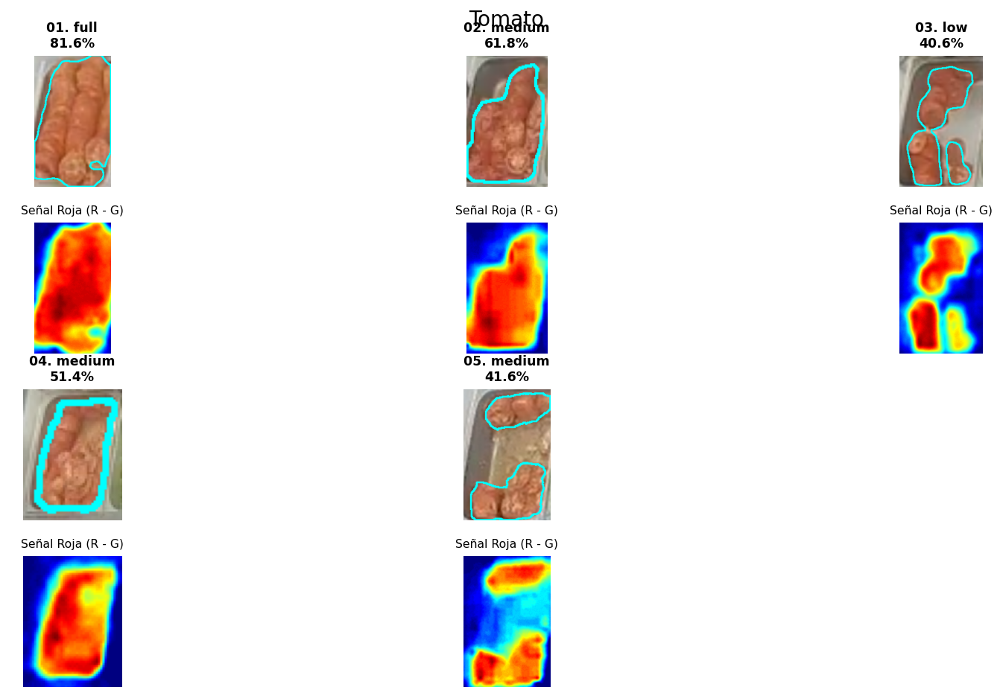

# Informe Técnico: Algoritmo Espectral con Separación Morfológica para Detección de Tomates

**Fecha:** 01 de Diciembre, 2025  
**Contexto:** Visión por Computador / Procesamiento de Imágenes  
**Objeto de Estudio:** Segmentación de rodajas de tomate (*Solanum lycopersicum*) en bandejas de acero inoxidable.

---

## 1. Resumen Ejecutivo
El presente documento detalla la metodología algorítmica para la cuantificación de rodajas de tomate. Este producto presenta un desafío dual: comparte la firma espectral roja del tocino, pero introduce una problemática de **fluidos (jugo)** que tiende a conectar visualmente rodajas separadas. La solución implementada utiliza una **sustracción de canales estricta** para la detección cromática, reforzada por una etapa de **Apertura Morfológica (Opening)** diseñada específicamente para cortar puentes líquidos y segmentar el producto en "islas" topológicas independientes.

---

### Resultados Visuales

A continuación se presentan los resultados de la segmentación donde se aprecia la separación de rodajas individuales (islas) gracias al corte estricto y el procesamiento morfológico:

  
  
<em>Figura 1: Mapa de calor espectral y contornos cyan delimitando islas de producto, ignorando puentes de líquido.</em>

## 2. Metodología

A diferencia del tocino, donde se buscaba recuperar zonas oscuras, en el tomate el objetivo es **rechazar zonas tenues** (jugo translúcido). El algoritmo se estructura en tres fases críticas:

### 2.1. Diferenciación Espectral Estricta (Strict Spectral Subtraction)

Se explota la naturaleza biológica del tomate (alto contenido de pigmento rojo) frente a la neutralidad del acero inoxidable. Se calcula la señal de diferencia:

$$D(x,y) = R(x,y) - G(x,y)$$

**Normalización y "Suelo de Lava" (The Floor is Lava):**
Tras normalizar la señal al rango $[0, 255]$, se aplica un umbral de corte significativamente elevado ($T=120$).

* **Fundamento:** El "agua de tomate" o jugo presente en la bandeja genera una señal espectral débil (visible como zonas cian/azules en el mapa de calor). Al establecer el corte en $120$, se fuerza al algoritmo a ignorar matemáticamente cualquier píxel que no posea la intensidad cromática de la pulpa sólida, eliminando el ruido de fondo líquido desde la raíz.

### 2.2. Filtro de Solidez (Saturación HSV)

Para reforzar la distinción entre "líquido rojo diluido" y "carne sólida", se introduce una validación en el espacio HSV.
* **Canal S (Saturación):** Se exige un valor $S > 60$.
* **Objetivo:** Descartar reflejos en el metal húmedo que, aunque puedan tener un tinte rojizo, carecen de la pureza de color del vegetal.

La máscara base se obtiene mediante la intersección lógica:
$$M_{base} = M_{spectral} \cap M_{saturation}$$

### 2.3. Segmentación de Islas (Morphological Opening)

El desafío geométrico final es que las rodajas, al estar húmedas, tienden a tocarse o unirse por tensión superficial. Un enfoque tradicional de "Cierre" fusionaría todo en un solo bloque (bloqueando la detección de espacios vacíos).

Se implementa una operación de **Apertura Morfológica (Opening)**:
$$Open(A, B) = Dilate(Erode(A, B))$$

1.  **Erosión:** Contrae los bordes de los objetos detectados. Esto rompe los istmos o "puentes" finos formados por el contacto de fluidos entre rodajas.
2.  **Dilatación:** Restaura el tamaño aproximado de los núcleos restantes.

**Resultado:** Esta operación convierte una masa amorfa en un conjunto de "islas" discretas, permitiendo que la línea de contorno (Cyan) abrace individualmente las zonas de alta densidad, reflejando fielmente la distribución del producto.

---

## 3. Conclusión Técnica

La estrategia para el tomate difiere de la del tocino en su **rigor selectivo**. Mientras que el tocino requiere "recuperar" información oscura, el tomate requiere "purgar" información líquida. La combinación de un umbral espectral alto ($T=120$) con la apertura morfológica garantiza que el sistema mida volumen de alimento sólido y no superficie de mancha líquida, asegurando la linealidad métrica entre bandejas llenas y semivacías.